# Smart Plantation Safety Monitoring System

Sistem monitoring keselamatan kerja berbasis AI untuk area perkebunan menggunakan **YOLOv8** dan **ByteTrack**. Sistem ini mendeteksi pelanggaran APD (Alat Pelindung Diri) seperti helm dan rompi keselamatan, serta mendeteksi bahaya kebakaran dan asap secara real-time dari gambar maupun video CCTV.

---

##  Daftar Isi

- [Fitur Utama](#-fitur-utama)
- [Arsitektur Sistem](#-arsitektur-sistem)
- [Teknologi yang Digunakan](#-teknologi-yang-digunakan)
- [Struktur Proyek](#-struktur-proyek)
- [Prasyarat](#-prasyarat)
- [Instalasi](#-instalasi)
- [Konfigurasi](#-konfigurasi)
- [Cara Menjalankan](#-cara-menjalankan)
- [Endpoint API](#-endpoint-api)
- [Kelas Deteksi](#-kelas-deteksi)
- [Pipeline Pemrosesan](#-pipeline-pemrosesan)
- [Training Model](#-training-model)
- [Screenshot](#-screenshot)

---

## Fitur Utama

| Fitur | Deskripsi |
|---|---|
| **Deteksi APD** | Mendeteksi keberadaan helm dan rompi keselamatan pada setiap pekerja |
| **Deteksi Kebakaran & Asap** | Mengenali api dan asap secara otomatis pada frame video/gambar |
|  **Pemrosesan Video** | Analisis video frame-by-frame dengan anotasi bounding box berwarna |
|  **Deteksi Gambar** | Upload dan proses gambar statis untuk deteksi PPE instan |
|  **Statistik Real-time** | Menampilkan statistik kepatuhan APD, jumlah objek, dan status keselamatan |
|  **AI Safety Report** | Laporan keselamatan otomatis yang dihasilkan oleh LLM (Ollama Cloud) |
|  **Galeri Pelanggaran** | Menyimpan snapshot frame yang mengandung pelanggaran untuk dokumentasi |
|  **Timeline Alert** | Mencatat kronologi perubahan status pelanggaran selama durasi video |
|  **Object Tracking** | Pelacakan objek antar frame menggunakan algoritma ByteTrack |

---

##  Arsitektur Sistem

```
┌──────────────────────────────┐
│       Streamlit Dashboard    │
│        (dashboard/app.py)    │
│                              │
│  ┌─────────┬────────┬──────┐ │
│  │  Image  │ Video  │Galeri│ │
│  │Detection│Detection│     │ │
│  └────┬────┴───┬────┴──┬──┘ │
└───────┼────────┼───────┼────┘
        │  HTTP  │       │
        ▼        ▼       ▼
┌──────────────────────────────┐
│       FastAPI Backend        │
│       (backend/main.py)      │
│                              │
│  ┌──────────────────────┐    │
│  │  PlantationDetector  │    │
│  │     (YOLOv8)         │    │
│  └──────────┬───────────┘    │
│             ▼                │
│  ┌──────────────────────┐    │
│  │  PlantationTracker   │    │
│  │    (ByteTrack)       │    │
│  └──────────┬───────────┘    │
│             ▼                │
│  ┌──────────────────────┐    │
│  │   ViolationEngine    │    │
│  │  (Cek PPE & Bahaya)  │    │
│  └──────────┬───────────┘    │
│             ▼                │
│  ┌──────────────────────┐    │
│  │  AI Report Generator │    │
│  │   (Ollama Cloud)     │    │
│  └──────────────────────┘    │
└──────────────────────────────┘
```

---

##  Teknologi yang Digunakan

| Kategori | Teknologi |
|---|---|
| **Model Deteksi** | YOLOv8s (Ultralytics) — di-training custom dengan 8 kelas |
| **Object Tracking** | ByteTrack via Supervision |
| **Backend API** | FastAPI |
| **Dashboard** | Streamlit |
| **Computer Vision** | OpenCV |
| **AI Report** | Ollama Cloud API (model `gpt-oss:120b`) |
| **Video Encoding** | FFmpeg (re-encode ke H.264) |
| **Bahasa** | Python 3.10+ |

---

##  Struktur Proyek

```
smart-plantation-monitoring/
│
├── backend/                        # Backend API (FastAPI)
│   ├── main.py                     # Entry point FastAPI, definisi semua endpoint
│   ├── detector.py                 # Wrapper model YOLOv8 untuk deteksi objek
│   ├── tracker.py                  # Pelacakan objek menggunakan ByteTrack
│   ├── violation_engine.py         # Logika pemeriksaan pelanggaran PPE
│   ├── video_processor.py          # Pipeline pemrosesan video frame-by-frame
│   ├── statistics_engine.py        # Akumulasi statistik pelanggaran per video
│   ├── timeline_engine.py          # Pencatatan event pelanggaran berbasis waktu
│   ├── snapshot_manager.py         # Penyimpanan snapshot frame pelanggaran
│   ├── ai_report_generator.py      # Generator laporan AI menggunakan Ollama Cloud
│   ├── image_processor.py          # Utilitas pemrosesan gambar
│   ├── models/                     # Direktori model YOLOv8 (best.pt)
│   ├── uploads/                    # File upload sementara
│   ├── outputs/                    # Video output yang sudah dianotasi
│   └── snapshots/                  # Snapshot pelanggaran per kategori
│       ├── no_helmet/
│       ├── no_safety_vest/
│       ├── fire/
│       └── smoke/
│
├── dashboard/                      # Frontend Dashboard (Streamlit)
│   └── app.py                      # Aplikasi dashboard dengan 3 tab
│
├── training/                       # Script pelatihan model
│   ├── train.py                    # Script training YOLOv8 dengan konfigurasi lengkap
│   └── merge_dataset.py            # Script penggabungan multi-dataset
│
├── datasets/                       # Dataset (tidak di-commit, ada di .gitignore)
├── models/                         # Output training model
├── configs/                        # File konfigurasi
├── notebooks/                      # Jupyter notebooks untuk eksplorasi
├── docs/                           # Dokumentasi tambahan
│
├── .env                            # API key Ollama (tidak di-commit)
├── .gitignore                      # Daftar file/folder yang diabaikan Git
└── requirements.txt                # Daftar dependensi Python
```

---

##  Prasyarat

Pastikan perangkat Anda sudah memiliki:

- **Python** 3.10 atau lebih baru
- **FFmpeg** — terinstal dan tersedia di PATH sistem
  - Windows: Download dari [ffmpeg.org](https://ffmpeg.org/download.html) dan tambahkan ke PATH
  - Linux/Mac: `sudo apt install ffmpeg` atau `brew install ffmpeg`
- **GPU (opsional tapi direkomendasikan)** — NVIDIA GPU dengan CUDA untuk akselerasi inferensi
- **Ollama API Key** — untuk fitur AI Safety Report (opsional)

---

##  Instalasi

### 1. Clone Repository

```bash
git clone https://github.com/kevinprsetyo/smart-plantation-monitoring.git
cd smart-plantation-monitoring
```

### 2. Buat Virtual Environment

```bash
python -m venv venv

# Windows
venv\Scripts\activate

# Linux / Mac
source venv/bin/activate
```

### 3. Install Dependensi

```bash
pip install -r requirements.txt
```

### 4. Siapkan Model

Tempatkan file model YOLOv8 yang sudah di-training (`best.pt`) ke dalam direktori:

```
backend/models/best.pt
```

> **Catatan:** File model tidak disertakan dalam repository karena ukurannya besar. Anda perlu melakukan training sendiri atau menggunakan model yang sudah tersedia.

---

##  Konfigurasi

### Environment Variables

Buat file `.env` di root proyek:

```env
# API Key untuk Ollama Cloud (diperlukan untuk fitur AI Safety Report)
OLLAMA_API_KEY=your_api_key_here
```

**Cara mendapatkan Ollama API Key:**
1. Daftar/login di [https://ollama.com](https://ollama.com)
2. Buka **Settings → API Keys**
3. Buat API Key baru dan salin ke file `.env`

> **Catatan:** File `.env` sudah ditambahkan ke `.gitignore` dan tidak akan ter-commit ke repository.

---

##  Cara Menjalankan

### 1. Jalankan Backend (FastAPI)

```bash
uvicorn backend.main:app --reload --host 127.0.0.1 --port 8000
```

Backend akan berjalan di `http://127.0.0.1:8000`

### 2. Jalankan Dashboard (Streamlit)

Buka terminal baru dan jalankan:

```bash
streamlit run dashboard/app.py
```

Dashboard akan terbuka otomatis di browser (default: `http://localhost:8501`)

> **Penting:** FastAPI harus sudah berjalan di port 8000 sebelum Streamlit dijalankan.

---

##  Endpoint API

| Method | Endpoint | Deskripsi |
|---|---|---|
| `GET` | `/` | Health check dan info sistem |
| `GET` | `/video/{filename}` | Serve file video output (H.264 MP4) |
| `GET` | `/gallery` | Daftar semua snapshot pelanggaran |
| `GET` | `/snapshot/{category}/{filename}` | Serve satu file snapshot JPEG |
| `POST` | `/predict-image` | Deteksi APD pada gambar statis |
| `POST` | `/predict-video` | Deteksi APD pada video (frame by frame) |

### Contoh Response `POST /predict-image`

```json
{
  "output_image": "backend/outputs/output_image.jpg",
  "ppe_statistics": {
    "safe_worker": 5,
    "no_helmet": 2,
    "no_safety_vest": 1
  },
  "violations": [
    {"track_id": 1, "status": "SAFE"},
    {"track_id": 2, "status": "NO_HELMET"}
  ],
  "object_count": {
    "person": 8, "helmet": 5, "safety_vest": 7,
    "truck": 1, "forklift": 0, "excavator": 0,
    "fire": 0, "smoke": 0
  },
  "ai_report": "Laporan keselamatan..."
}
```

---

##  Kelas Deteksi

Model YOLOv8 dilatih untuk mendeteksi **8 kelas objek**:

| Class ID | Nama Kelas | Deskripsi |
|---|---|---|
| 0 | `person` | Pekerja / manusia |
| 1 | `helmet` | Helm keselamatan |
| 2 | `safety_vest` | Rompi keselamatan |
| 3 | `truck` | Truk |
| 4 | `forklift` | Forklift |
| 5 | `excavator` | Ekskavator |
| 6 | `fire` | Api / kebakaran |
| 7 | `smoke` | Asap |

---

## Pipeline Pemrosesan

### Deteksi Gambar
```
Upload Gambar → Decode → YOLOv8 Deteksi → ByteTrack → Cek PPE → Anotasi → AI Report → Response
```

### Deteksi Video
```
Upload Video → Baca Frame → Deteksi per Frame → Tracking → Cek Pelanggaran
     → Update Statistik → Catat Timeline → Simpan Snapshot → Anotasi Frame
     → Tulis Video (mp4v) → Re-encode H.264 (FFmpeg) → AI Report → Response
```

### Logika Pemeriksaan PPE

| Kondisi | Status |
|---|---|
| Helm ✅ dan Rompi ✅ | `SAFE` |
| Helm ❌ | `NO_HELMET` |
| Helm ✅ dan Rompi ❌ | `NO_SAFETY_VEST` |

**Metode pemeriksaan:**
- **Helm**: Pusat bounding box helm harus berada di **35% atas** bounding box person (area kepala)
- **Rompi**: Pusat bounding box rompi harus berada di **25%-100%** bounding box person (area torso ke bawah)

---

##  Training Model

### Persiapan Dataset

Proyek ini menggunakan 3 dataset yang digabungkan:

| Dataset | Kelas Asli | Kelas Baru (Setelah Mapping) |
|---|---|---|
| **PPE** | person, helmet, safety_vest | 0, 1, 2 |
| **Vehicle** | dump, mixer, moxy → truck; loader → forklift; excavator, roller → excavator | 3, 4, 5 |
| **Fire** | fire, smoke | 6, 7 |

Jalankan script penggabungan dataset:

```bash
python training/merge_dataset.py
```

### Memulai Training

```bash
python training/train.py
```

**Konfigurasi Training:**

| Parameter | Nilai |
|---|---|
| Base Model | YOLOv8s (pretrained) |
| Epochs | 100 |
| Patience | 30 (early stopping) |
| Image Size | 640×640 |
| Batch Size | 16 |
| Optimizer | AdamW |
| Learning Rate Schedule | Cosine Annealing |
| Mixed Precision | Aktif (AMP) |
| Augmentasi | HSV, rotasi, flip, mosaic, mixup |

---

##  Screenshot

Berikut adalah tampilan visual sistem monitoring saat mendeteksi pekerja dan memproses gambar serta video:

### A. Fitur Deteksi Gambar (Image Detection)

#### 1. Unggah Gambar & Input Preview
Menu untuk mengunggah gambar (`.jpg` atau `.png`) untuk diproses oleh sistem.
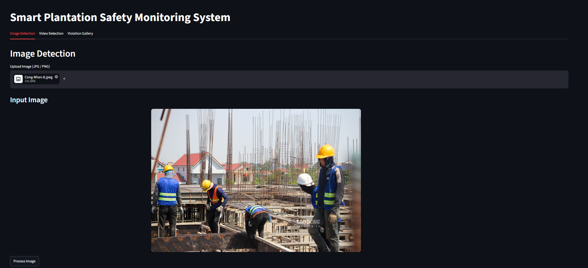

#### 2. Output Gambar Deteksi (YOLOv8 & Bounding Box)
Hasil proses deteksi dengan anotasi status kepatuhan APD (`SAFE`, `NO_HELMET`, atau `NO_SAFETY_VEST`) beserta koordinat bounding box.
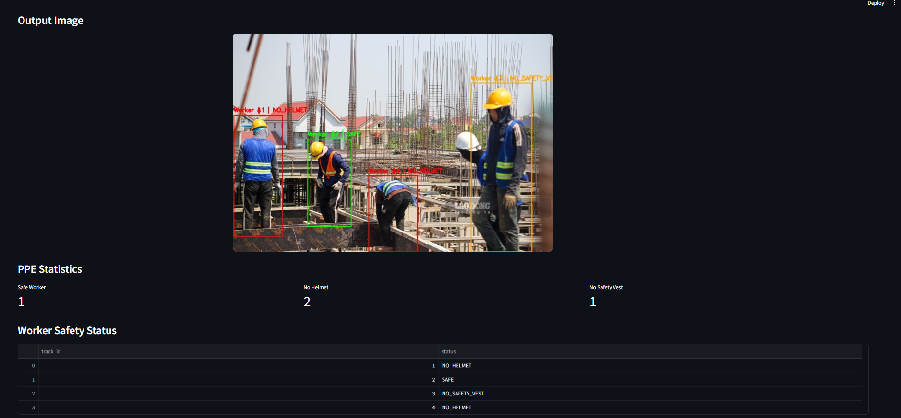

#### 3. Statistik Objek Terdeteksi & Ringkasan Laporan AI (Bagian 1)
Menunjukkan jumlah person, helmet, safety vest, kendaraan, dan api/asap beserta ringkasan awal laporan.
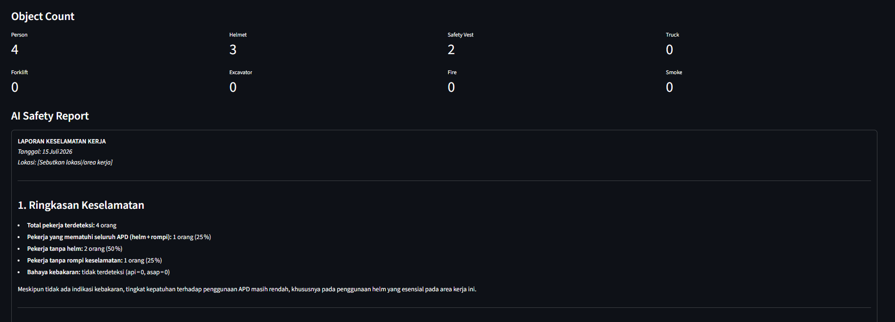

#### 4. Persentase Kepatuhan APD & Penilaian Risiko (Bagian 2)
Tabel kepatuhan kerja dan analisa tingkat risiko berdasarkan status pekerja.
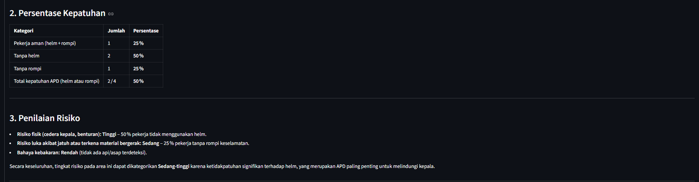

#### 5. Rekomendasi Keselamatan Kerja dari AI (Bagian 3)
Rekomendasi taktis dan operasional yang diberikan secara otomatis oleh sistem kepada petugas safety supervisor.
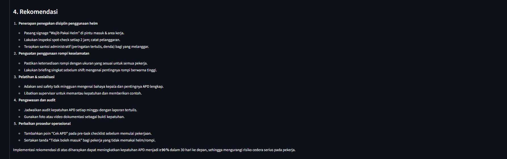

---

### B. Fitur Deteksi Video (Video Detection)

#### 1. Unggah Video & Input Preview
Menu untuk mengunggah rekaman video CCTV (`.mp4`) untuk diproses frame-by-frame.
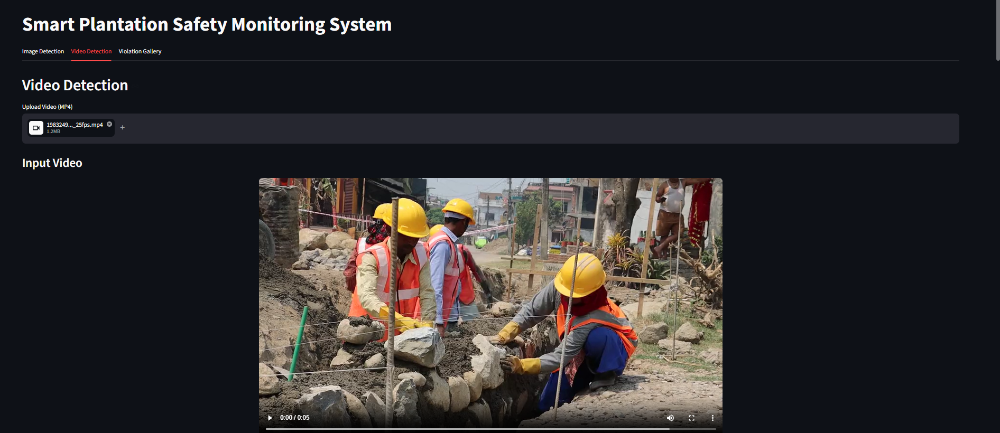

#### 2. Hasil Deteksi & Tracking Video (Output Video)
Menampilkan video terproses dengan tracker visual (ByteTrack) yang memberikan ID konstan pada pekerja beserta bounding box yang menunjukkan status APD secara real-time.
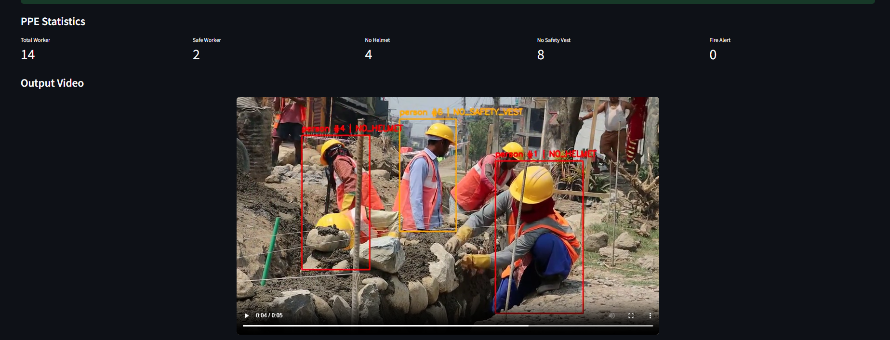

#### 3. Timeline Alert & Status Kepatuhan Pekerja
Kronologi peringatan pelanggaran detail per detik beserta tabel list ID pekerja beserta status akhir kepatuhan mereka.
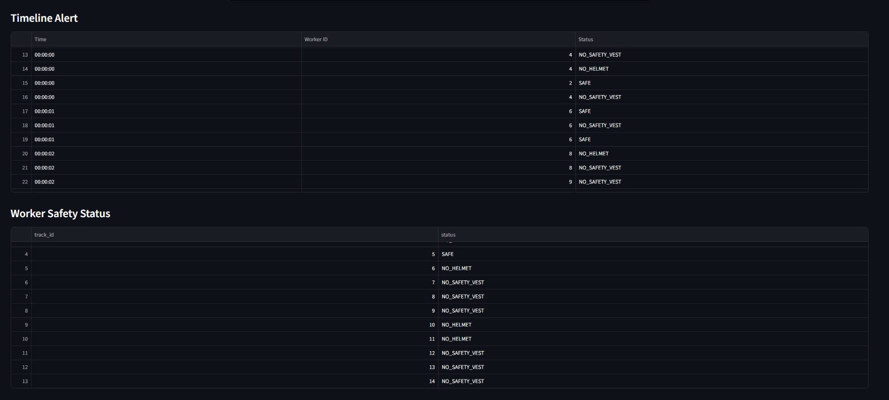

#### 4. Total Statistik Maksimum Objek per Frame
Grafik statistik tertinggi dari objek yang terdeteksi secara bersamaan di dalam satu frame.
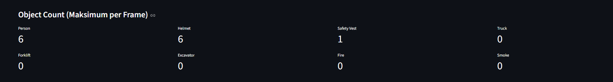

#### 5. Laporan Keselamatan AI dari Rekaman Video — Bagian 1 (Ringkasan & Persentase)
Laporan evaluasi keselamatan dan kepatuhan APD berdasarkan rekaman video yang dianalisa oleh LLM.
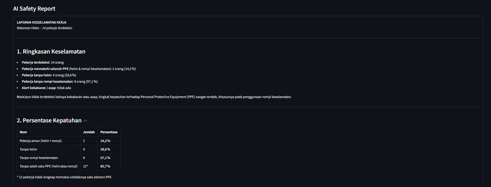

#### 6. Laporan Keselamatan AI dari Rekaman Video — Bagian 2 (Penilaian Risiko)
Penilaian tingkat risiko keselamatan pekerja di lapangan berdasarkan hasil analisis video.
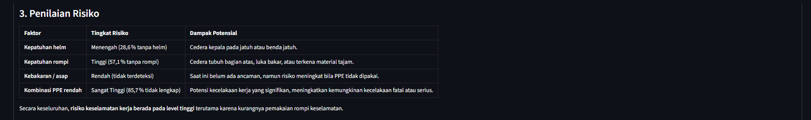

#### 7. Laporan Keselamatan AI dari Rekaman Video — Bagian 3 (Rekomendasi)
Rekomendasi tindakan korektif yang diberikan oleh LLM kepada tim safety supervisor.
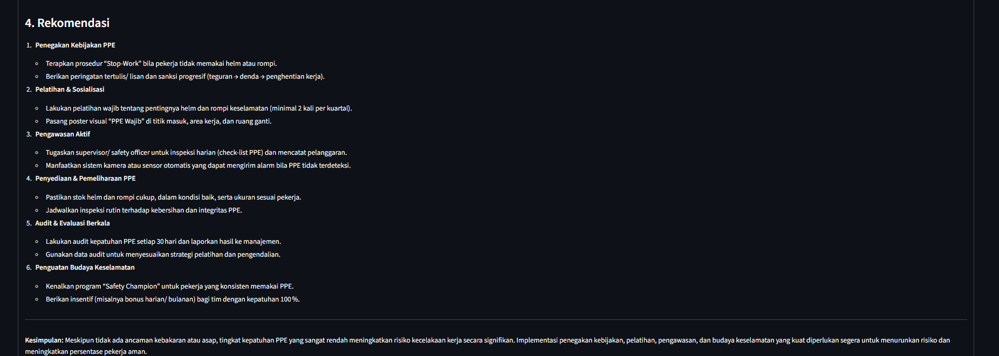

